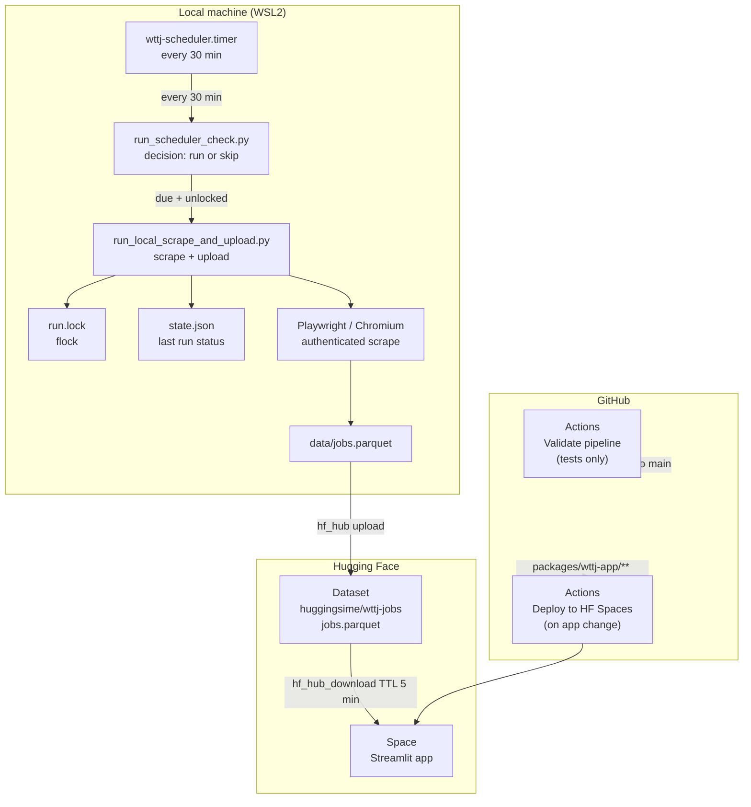

# WTTJ Jobs Scraper

Scrapes authenticated job offers from Welcome to the Jungle daily, stores them as Parquet on Hugging Face, and exposes them via a Streamlit app.

## Architecture



## Components

| Component | Where it runs | What it does |
|---|---|---|
| `wttj-scheduler.timer` | Local WSL2 | Wakes the scheduler every 30 min |
| `run_scheduler_check.py` | Local WSL2 | Decides whether today's scrape is due |
| `run_local_scrape_and_upload.py` | Local WSL2 | Runs scrape → parquet → HF upload |
| HF Dataset `huggingsime/wttj-jobs` | Hugging Face | Stores `jobs.parquet` (private) |
| HF Space (Streamlit) | Hugging Face | Browsing UI with auth, filters, CSV export |
| `Validate WTTJ Pipeline` | GitHub Actions | Runs test suite on every push/PR |
| `Deploy to HF Spaces` | GitHub Actions | Redeploys app when `packages/wttj-app/**` changes |

## Scheduling logic

The scheduler picks a **deterministic random time** each day within a configured window (default `03:30–05:30`). The target is computed from a SHA-256 hash of the seed + date, so it is stable across restarts but varies day to day.

```
Timer fires every 30 min
  └─ already succeeded today?  → skip
  └─ already failed today?     → skip
  └─ lock held?                → skip (another run in progress)
  └─ before target time?       → skip
  └─ otherwise                 → start wttj-scrape.service
```

## Repository layout

```
.
├── packages/
│   ├── wttj-models/     # Pydantic data models
│   ├── wttj-scraper/    # Playwright scraper + scheduler logic
│   ├── wttj-cli/        # CLI entrypoint (wttj command)
│   └── wttj-app/        # Streamlit browsing app
├── scripts/
│   ├── scrape_matches_to_parquet.py   # authenticated scrape
│   ├── upload_parquet_to_hf.py        # standalone HF upload
│   ├── run_local_scrape_and_upload.py # orchestrator (called by systemd)
│   └── run_scheduler_check.py         # scheduling decision (called by timer)
├── deploy/systemd/      # systemd unit files
├── config/
│   └── wttj_matches.yaml  # role families, filters, limits
└── docs/
    ├── local-wttj-scheduler-wsl.md  # install + ops guide
    └── self-hosted-runner-wsl.md    # deprecated
```

## Initial setup

### 1. Clone and install

```bash
git clone https://github.com/ssime-git/scraping_wtj
cd scraping_wtj
uv sync --all-extras
uv run playwright install chromium
```

### 2. Configure environment

```bash
cat > ~/.config/wttj-scrape.env << 'EOF'
WTTJ_EMAIL=<your WTTJ email>
WTTJ_PASSWORD=<your WTTJ password>
HF_TOKEN=<your Hugging Face token>
HF_DATASET_REPO=<hf-username/dataset-name>
WTTJ_MATCHES_CONFIG=/path/to/scraping_wtj/config/wttj_matches.yaml
DATA_DIR=/path/to/scraping_wtj/data
WTTJ_DEBUG_DIR=/path/to/scraping_wtj/artifacts/wttj-debug
WTTJ_WINDOW_START=03:30
WTTJ_WINDOW_END=05:30
WTTJ_SCHEDULER_SEED=wttj-prod
EOF
```

### 3. Install systemd units

```bash
mkdir -p ~/.config/systemd/user ~/.local/state/wttj-scrape
cp deploy/systemd/wttj-scrape.service ~/.config/systemd/user/
cp deploy/systemd/wttj-scheduler.service ~/.config/systemd/user/
cp deploy/systemd/wttj-scheduler.timer ~/.config/systemd/user/
systemctl --user daemon-reload
systemctl --user enable --now wttj-scheduler.timer
```

## Operations

```bash
# Check timer status and next scheduled wake-up
systemctl --user status wttj-scheduler.timer

# Trigger a scrape immediately (bypasses scheduling logic)
systemctl --user start wttj-scrape.service

# Follow scrape logs live
journalctl --user -u wttj-scrape.service -f

# View scheduler decision logs
journalctl --user -u wttj-scheduler.service -n 50 --no-pager

# Inspect current scheduler state
cat ~/.local/state/wttj-scrape/state.json

# Run tests
uv run pytest
```

## GitHub Actions

| Workflow | Trigger | Purpose |
|---|---|---|
| `Validate WTTJ Pipeline` | push / PR to `main` | Run full test suite |
| `Deploy to HF Spaces` | push to `packages/wttj-app/**` on `main` | Redeploy Streamlit app |

Neither workflow runs the live scrape. All scraping runs locally via systemd.

## Packages

| Package | Description |
|---|---|
| [`wttj-models`](packages/wttj-models) | Pydantic models: `JobListing`, `JobDetail`, `ScrapeResult` |
| [`wttj-scraper`](packages/wttj-scraper) | Playwright scraper, authenticated matches pipeline, local scheduler |
| [`wttj-cli`](packages/wttj-cli) | `wttj` CLI command for ad-hoc scraping |
| [`wttj-app`](packages/wttj-app) | Streamlit app deployed on Hugging Face Spaces |
