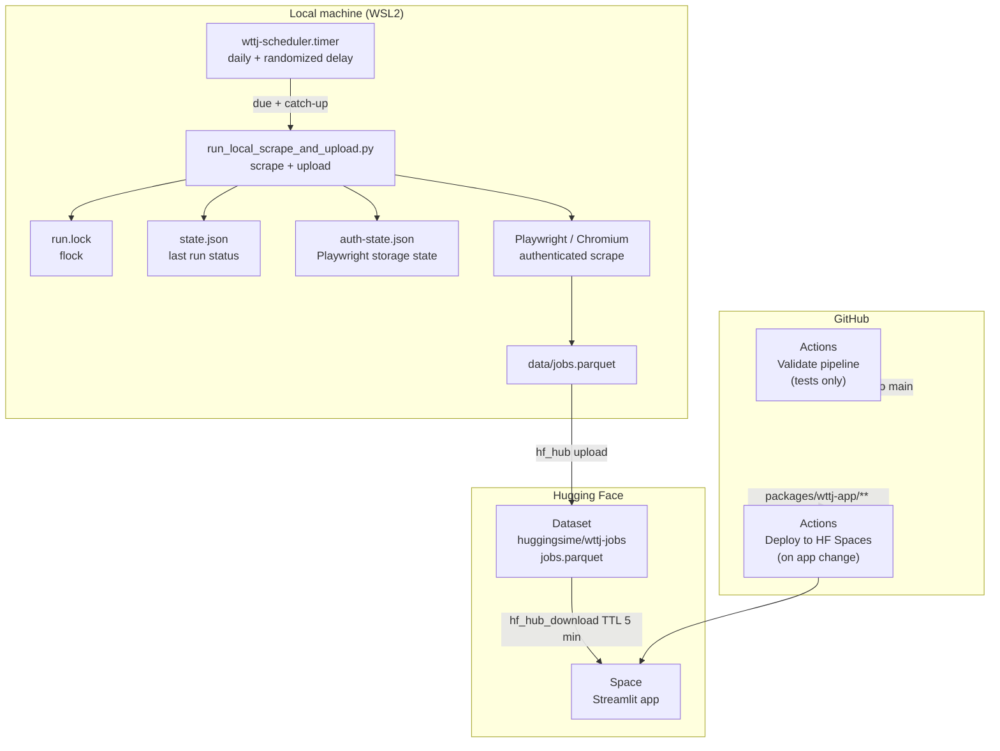

# WTTJ Jobs Scraper

Scrapes authenticated job offers from Welcome to the Jungle daily, stores them as Parquet on Hugging Face, and exposes them via a Streamlit app.

## Architecture


```mermaid
flowchart TD
    subgraph LOCAL["Local machine (WSL2)"]
        TIMER["wttj-scheduler.timer\ndaily + randomized delay"]
        SCRAPE["run_local_scrape_and_upload.py\nscrape + upload"]
        LOCK["run.lock\nflock"]
        STATE["state.json\nlast run status"]
        AUTH["auth-state.json\nPlaywright storage state"]
        BROWSER["Playwright / Chromium\nauthenticated scrape"]
        PARQUET["data/jobs.parquet"]
    end

    subgraph HF["Hugging Face"]
        DATASET["Dataset\nhuggingsime/wttj-jobs\njobs.parquet"]
        SPACE["Space\nStreamlit app"]
    end

    subgraph GH["GitHub"]
        CI["Actions\nValidate pipeline\n(tests only)"]
        DEPLOY["Actions\nDeploy to HF Spaces\n(on app change)"]
    end

    TIMER -->|"due + catch-up"| SCRAPE
    SCRAPE --> LOCK
    SCRAPE --> STATE
    SCRAPE --> AUTH
    SCRAPE --> BROWSER
    BROWSER --> PARQUET
    PARQUET -->|"hf_hub upload"| DATASET
    DATASET -->|"hf_hub_download TTL 5 min"| SPACE

    GH -->|"push to main"| CI
    GH -->|"packages/wttj-app/** changed"| DEPLOY
    DEPLOY --> SPACE
```

## Components

| Component | Where it runs | What it does |
|---|---|---|
| `wttj-scheduler.timer` | Local WSL2 | Runs the scrape daily with a 2h randomized delay and reboot catch-up |
| `run_local_scrape_and_upload.py` | Local WSL2 | Runs scrape → parquet → HF upload |
| `auth-state.json` | Local WSL2 | Cached Playwright storage state used for headless reauth |
| HF Dataset `huggingsime/wttj-jobs` | Hugging Face | Stores `jobs.parquet` (private) |
| HF Space (Streamlit) | Hugging Face | Browsing UI with auth, filters, CSV export |
| `Validate WTTJ Pipeline` | GitHub Actions | Runs test suite on every push/PR |
| `Deploy to HF Spaces` | GitHub Actions | Redeploys app when `packages/wttj-app/**` changes |

## Scheduling logic

Systemd runs the scrape once per day at `03:30` plus up to `2h` of native randomized delay. `Persistent=true` catches up a missed run when WSL starts again.

```
Timer due or caught up
  └─ start wttj-scrape.service
      └─ flock prevents overlap
      └─ systemd retries failed runs
```

## Repository layout

```
.
├── packages/
│   ├── wttj-models/     # Pydantic data models
│   ├── wttj-scraper/    # Playwright scraper + run state helpers
│   ├── wttj-cli/        # CLI entrypoint (wttj command)
│   └── wttj-app/        # Streamlit browsing app
├── scripts/
│   ├── scrape_matches_to_parquet.py   # authenticated scrape
│   ├── upload_parquet_to_hf.py        # standalone HF upload
│   └── run_local_scrape_and_upload.py # scrape + upload job (called by systemd)
├── deploy/systemd/      # systemd unit files
├── deploy/windows/      # WSL bootstrap scheduled task helper
├── config/
│   └── wttj_matches.yaml  # role families, filters, limits
└── docs/
    ├── local-wttj-scheduler-wsl.md  # install + ops guide
    └── self-hosted-runner-wsl.md    # deprecated
```

## Initial setup

### 1. Clone and install

```bash
git clone https://github.com/ssime-git/scraping_wtj
cd scraping_wtj
uv sync --all-extras
uv run playwright install chromium
```

### 2. Configure environment

```bash
cat > ~/.config/wttj-scrape.env << 'EOF'
WTTJ_EMAIL=<your WTTJ email>
WTTJ_PASSWORD=<your WTTJ password>
HF_TOKEN=<your Hugging Face token>
HF_DATASET_REPO=<hf-username/dataset-name>
WTTJ_MATCHES_CONFIG=/path/to/scraping_wtj/config/wttj_matches.yaml
DATA_DIR=/path/to/scraping_wtj/data
WTTJ_DEBUG_DIR=/path/to/scraping_wtj/artifacts/wttj-debug
WTTJ_AUTH_STATE_PATH=/path/to/.local/state/wttj-scrape/auth-state.json
EOF
```

### 3. Install systemd units

Symlinks keep the unit files in sync with the repo — after a `git pull` that modifies them, a `daemon-reload` is all that's needed.

```bash
mkdir -p ~/.config/systemd/user ~/.local/state/wttj-scrape
ln -sf "$(pwd)/deploy/systemd/wttj-scrape.service" ~/.config/systemd/user/
ln -sf "$(pwd)/deploy/systemd/wttj-scheduler.timer" ~/.config/systemd/user/
rm -f ~/.config/systemd/user/wttj-scheduler.service
loginctl enable-linger "$USER"
systemctl --user daemon-reload
systemctl --user enable --now wttj-scheduler.timer
```

On WSL, add a Windows scheduled task so the distro starts after Windows login
and systemd can catch up missed timers:

```powershell
powershell -ExecutionPolicy Bypass -File deploy/windows/register-wsl-bootstrap.ps1 -User seb
```

After any `git pull` that touches `deploy/systemd/`:

```bash
systemctl --user daemon-reload
```

## Operations

Prefer the `make` targets below. They wrap the `systemctl` and `journalctl` commands used by the service:

```bash
make wttj-scheduler-status
make wttj-status
make wttj-start
make wttj-restart
make wttj-logs
make wttj-scheduler-start
make wttj-scheduler-restart
make wttj-scheduler-logs
make wttj-refresh-auth
make wttj-state
make wttj-auth-state
make
UV_CACHE_DIR=/tmp/uv-cache uv run pytest
```

`make wttj-refresh-auth` runs the headless reauth bootstrap and writes the storage state to `~/.local/state/wttj-scrape/auth-state.json`. The scrape service reuses that file on subsequent runs.

## GitHub Actions

| Workflow | Trigger | Purpose |
|---|---|---|
| `Validate WTTJ Pipeline` | push / PR to `main` | Run full test suite |
| `Deploy to HF Spaces` | push to `packages/wttj-app/**` on `main` | Redeploy Streamlit app |

Neither workflow runs the live scrape. All scraping runs locally via systemd.

## Packages

| Package | Description |
|---|---|
| [`wttj-models`](packages/wttj-models) | Pydantic models: `JobListing`, `JobDetail`, `ScrapeResult` |
| [`wttj-scraper`](packages/wttj-scraper) | Playwright scraper, authenticated matches pipeline, run state helpers |
| [`wttj-cli`](packages/wttj-cli) | `wttj` CLI command for ad-hoc scraping |
| [`wttj-app`](packages/wttj-app) | Streamlit app deployed on Hugging Face Spaces |
